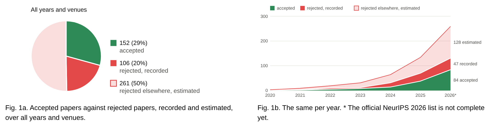
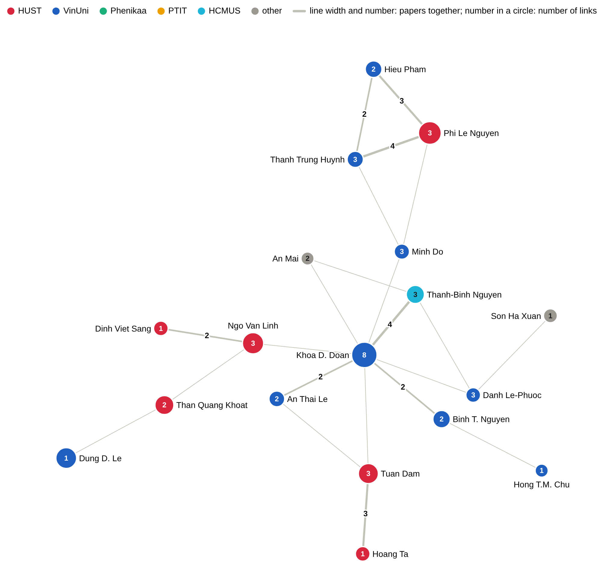

# Vietnam at top AI conferences

A bilingual (Vietnamese / English) static site that counts, for a hand-approved list of lecturers and professors in
Vietnam, the papers they submitted to and had accepted or rejected at ICLR, NeurIPS, ICML, CVPR, ICCV, ECCV, ACL and
EMNLP since 2020.

**Website: <https://thanhlexyz.github.io/vn-at-top-ai-conference/>**



*Accepted papers against rejected ones, all listed professors: ICLR rejections are counted, the rest are estimated
from each professor's own ICLR record.*



*Who works with whom: each circle is a professor on the list, coloured by institution; lines join people who share
papers, shorter for more shared papers.*

The figures are snapshots of the site; the live pages are updated with the data.

## How to maintain it

The site is maintained by asking an AI coding agent (for example Claude Code) to do the work, in plain words. Every
step is described in [CLAUDE.md](CLAUDE.md); Claude Code reads it automatically, and any other agent can be told to
read it first. Typical requests:

- "Track `<OpenReview profile URL>`, he is a lecturer at `<university>`."
- "Add these unofficial acceptances: `<announcement text, screenshot or link>`."
- "`<name>`'s photo is at `<link>`" or "their staff page is `<link>`".
- "This paper is wrong: `<link>`" (wrong person, wrong affiliation, missing paper).
- "Refresh the data" (for example after a conference publishes its accepted papers).
- "Publish."

Check the result on the local site (`make run`, then <http://localhost:1313>) or on the live site after publishing.

## What you need to do yourself

- **Set up once:** Python 3.10+, Hugo 0.156+, `poppler` (`pdftotext`), ImageMagick, and
  `pip install openreview-py opencv-python-headless`.
- **Give your OpenReview login** in the environment as `OPENREVIEW_USERNAME` and `OPENREVIEW_PASSWORD` (OpenReview
  is the only source of rejected papers; the agent never prints them).
- **Decide** what only you can decide: who belongs on the list, and the answers the agent asks for when a match is
  uncertain.
- **Keep private material out of the repository.** The repository is public: everything committed, including
  `backend/roster.csv` and its notes, is visible to everyone. Screenshots and downloads go to the git-ignored
  `backend/raw/`.

## Commands, if you want them

```
make run       # local site at http://localhost:1313
make data      # rebuild the data from the cached lists
make test      # checks of the counting rules
make publish   # build the public site and push it to GitHub Pages
```

Feedback from readers arrives as GitHub issues or by e-mail (see the site's Feedback page).
